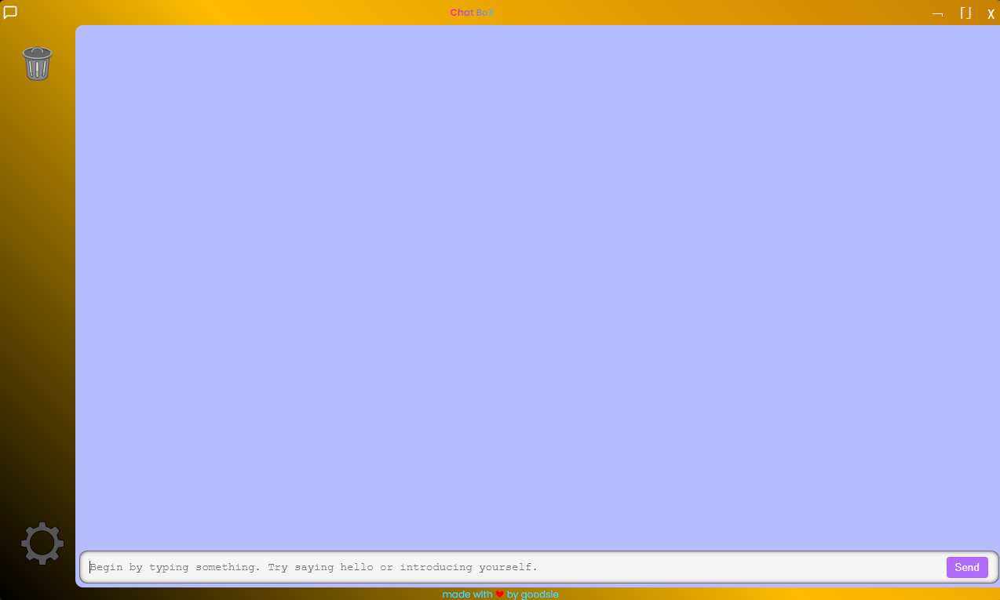

# electron-nextjs-starter-app

Welcome to the **electron-nextjs-starter-app**! This application seamlessly combines the power of Electron for desktop functionality with the efficiency of Next.js for modern web development. Whether you're a seasoned developer or just starting out, this starter app is designed to help you hit the ground running.

## Description

The **electron-nextjs-starter-app** is a versatile template that allows you to build cross-platform desktop applications using web technologies. With Electron handling the desktop environment and Next.js managing the web framework, you get the best of both worlds. This app is perfect for developers looking to create robust, high-performance desktop applications with a modern web interface.

## Installation

Getting started is easy! Follow these steps to set up your development environment:

1. Clone the repository:

    ```bash
    git clone https://github.com/gidsola/electron-nextjs-starter-app.git
    cd electron-nextjs-starter-app
    ```

2. Install dependencies:

    ```bash
    npm install
    ```

3. Open two bash terminals:

    - In the first terminal, run the Next.js development server:

      ```bash
      npm run dev
      ```

    - In the second terminal, start the Electron app:

      ```bash
      npm start
      ```

And that's it! You should now have the app up and running.

## Build Process

Building the application is straightforward. Here are the commands you need:

- **Build Next.js**:

  ```bash
  npm run build:next
  ```

- **Build Electron**:

  ```bash
  npm run build:electron
  ```

- **Build both Next.js and Electron**:

  ```bash
  npm run build
  ```

These commands will compile your application and prepare it for distribution.

## Development Mode Configuration

To ensure the app runs correctly in development mode, you need to set the `isDev` boolean inside `main.js`. This flag determines whether the app is running in development or production mode. In the future, this configuration will be moved to a dedicated `config/env` file for better maintainability.


## Preview

Check out a quick preview of the app in action:

[](./preview.mp4)


**Happy coding! 🚀**